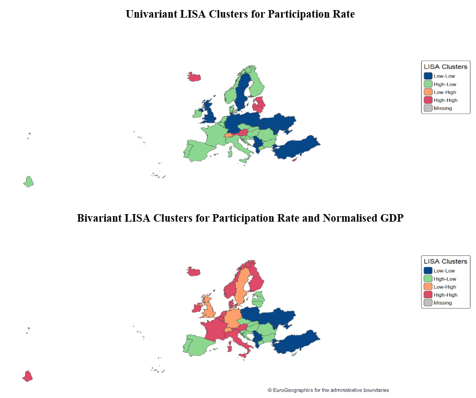

# Erasmus+ mobility trends: spatial analysis of the Erasmus+ mobility data between the years 2014 to 2022

This project analyse the K2 mobility data from the Erasmus+ project in the context of geographic location and economic ability of individual member countries.
 
H1a: The normalised GDP value predicts participation rate 

H1b: The participation rate clusters spatially (countries which are geographically closer have similar participation rate)


All the data utilised in this project is avaliable through the European Data Portal and Eurostat (European Commission & Eurostat, 2026). The four individual datasets can be found here: [K2 mobility](https://data.europa.eu/data/datasets/erasmus-mobility-raw-data?locale=en), [GDP](https://data.europa.eu/data/datasets/v5x9gcgmhdn8we8ykg6ylw?locale=en), [population](https://ec.europa.eu/eurostat/cache/metadata/en/demo_pop_esms.htm), [borders](https://ec.europa.eu/eurostat/web/gisco/geodata/administrative-units/countries).

## Steps for the analysis

This project requires R 4.5 or newer. In order to run this code, you must first download the data from the links above, then place the data in the "in" folder. Then do the following:

```
install.packages("renv")
renv::init() 
```

Then do this:

```
rmarkdown::render("erasmus_report.Rmd")
```

## Results

The initial analysis of the Erasmus+ mobility data revealed a significant positive global spatial autocorrelation for participation rate (Moran’s I = 0.4  p < 0.001) indicating geographical clusters for countries with similar participation rates. A significant positive global spatial autocorrelation was also found for the normalised GDP values (Moran’s I = 0.5  p < 0.001) which points to even stronger geographical clusters for countries with similar economic status. The three spatial models which were applied to examine the relationship between the participation and GDP were subsequently assessed. The SLX model found the effect of own GDP (𝛽 = 0.009, p < 0.001) and year (𝛽 = 0.008, p = 0.0016) to have a significant positive impact on the participation with a significant spatial lag of the time trend (𝛽 = 0.08, p = 0.0148). However the SEM model was the most representative of the data (AIC = -745.22) with a highly significant spatial error parameter( 𝜆 = 0.836 (p < 0.001)) and a substantial improvement over the non-spatial specifications (LR = 159.97 (p < 0.001)). Among these specifications, the GDP (𝛽 = 0.0091, SE = 0.0017, p < 0.001 ) and year (𝛽 = 0.0046, SE = 0.0016, p = 0.003 ), continue to be significant.  



## Discussion & Limitations

The analysis of the global autocorrelation indicates that Erasmus+ program participation rates are not distributed evenly across the European Union. The calculated LISA further reveal distinct clustering patterns, with the countries exhibiting low participation rates tending to cluster in Central and Eastern Europe while the countries exhibiting high participation rates cluster in South and Western Europe, partially supporting H1b. These patterns are consistent with the results of SEM model, which confirms that the country's individual wealth remains influential to participation rate while pointing to the presence of additional unobserved spatially structured factors that contribute to the overall participation rate. Such factors might include regional policy frameworks, differences in national education programs or funding allocation disparities. These findings partially support the H1a, as per the SEM model’s estimates, after accounting for spatially correlated unobserved factors, the participation increase is associated with rise in GDP value and over time. The increase is approximately 0.009 for each unit increase in the GDP value and by 0.004 per each consecutive year. The absence of a significant spillover effect indicates that the effect of GDP is direct and local, which makes the GDP a robust but not globally applicable predictor. Although the results indicate that the role of economic capability does play some role in the participation rate for the Erasmus+ programme, the spatial distribution of the participation is more strongly influenced by the regional politics and institutions in addition to the global increase over time. These results are somewhat related to the findings of the Petre et al. (2025) but indicate a slightly different outcome. While the 2025 study pointed to the participation and funding clustering in the wealthier parts of Europe, our analysis suggests that the economic capabilities of a country are not the primary driving indicator for participation, which changes the assumptions about the Erasmus+ accessibility. These results can be understood in two ways:

The participation rates are not indicative of true accessibility. 

In the case of this study the accessibility has been understood as an opportunity to take part in the Erasmus+ programme. Our assumption is that the accessibility is reflected by the participation rates - the more accessible the Erasmus+ initiatives are the greater the participant rate. What this analysis does not account for is whether the accessibility is met with interest. As can be seen in the results of our analysis and as compared to the Petre et al. (2025), the wealthier regions might get more participation opportunities however these opportunities might not be met with the level of interest or publicity the program might receive in less wealthy countries, what ties directly into the second possibility:
 
The accessibility of the Erasmus+ is guided by the regional policies and institutions rather than economic wealth.

The initiatives of the regional official institutions and the political realities of the region might outweigh the role of economic capabilities in regards to Erasmus+ opportunities. Regions more focused on the strengthening of EU bonds and education might be more keen on promoting the program and increase the overall interest in participation. The topic is further touched upon by studies such as (Fumasoli & Rossi, 2021) which explore the role of higher education institutions in the Erasmus+ program initiatives which finds that the institutions themselves play an important role in the Erasmus+ programme. 

Overall the results of this analysis point to interesting regional dependencies which might be more predictive of the success for Erasmus+.


## Refernces
European Commission, & Eurostat. (2026a). GISCO [Dataset]. https://ec.europa.eu/eurostat/web/gisco 

European Commission, & Eurostat. (2026b). Gross domestic product (GDP) and main components (output, expenditure and income)—Annual data. [Dataset]. http://data.europa.eu/88u/dataset/v5x9gcgmhdn8we8ykg6ylw 

Fumasoli, T., & Rossi, F. (2021). The role of higher education institutions in transnational networks for teaching and learning innovation: The case of the Erasmus+ programme. European Journal of Education, 56(2), 200–218. https://doi.org/10.1111/ejed.12454 

Petre, I.-D., Gheorghe, M., & Buşu, M. (2025). Analyzing Regional Trends in Erasmus+ Project Funding and Thematic Clusters through Heatmaps Visualizations. Proceedings of the ... International Conference on Business Excellence, 19(1), 216–224. https://doi.org/10.2478/picbe-2025-0019 

